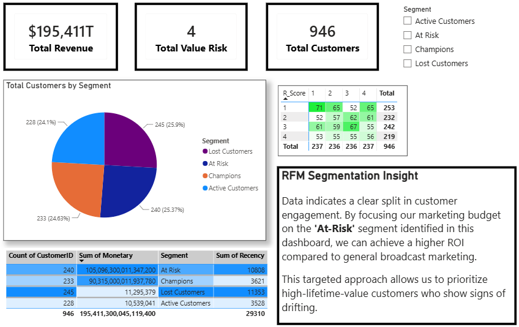

# Customer RFM Analysis Dashboard
A professional customer segmentation dashboard built to identify high-value "At-Risk" customers.

# Business Impact
- Identified 240 (25.37%) high-value customers at risk of churn.
- Provided actionable insights for marketing re-engagement campaigns.
  
# Tools Used
- **Python (Pandas):** For data cleaning and RFM segmentation.
- **Power BI:** For dashboard visualization and KPI tracking.

# Dashboard Preview

# Project Structure
- `RFM_analysis.ipynb`: Python code for data processing.
- `report.pbix`: Power BI file. 

